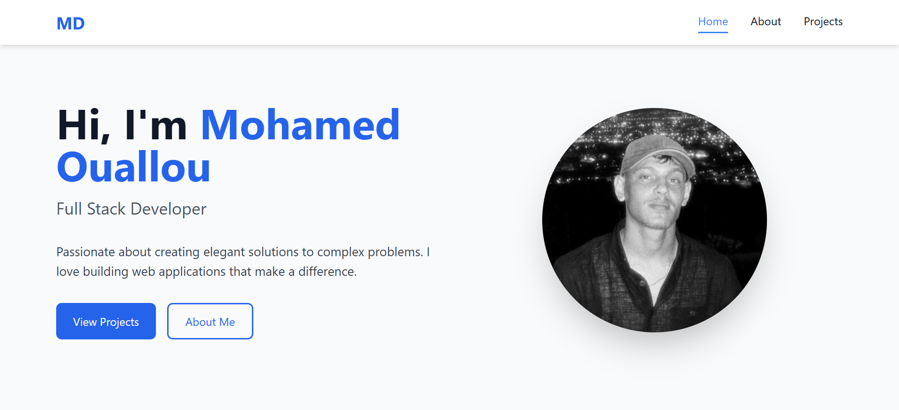

# Portfolio Développeur
**Réalisé par : Mohamed Ouallou**  

---

## 1) Cahier des charges d’un site web portfolio
- **Montrer clairement qui vous êtes**  
- **Mettre en avant vos compétences et projets**  
- **De façon attrayante et efficace**  
- **Pour attirer recruteurs, clients et partenaires**  
- **Client : Mehdi Bentaleb**

---

---

## 3) Use Case Diagram d’un site web portfolio

---

## Conception : Schéma

---

## Conception : Design thinking

---

## Conception : Defintion

 - **Empathize** —— Comprendre les utilisateurs : besoins, émotions, problèmes

 - **Define** —— Définir clairement le problème à résoudre

- **Ideate** —— Générer plusieurs idées créatives

 - **Prototype** —— Créer des versions simples ou maquettes

- **Test** —— Tester les prototypes et apprendre des retou

---

## Conception : Maquette

---

## Conception : Class diagram

---
